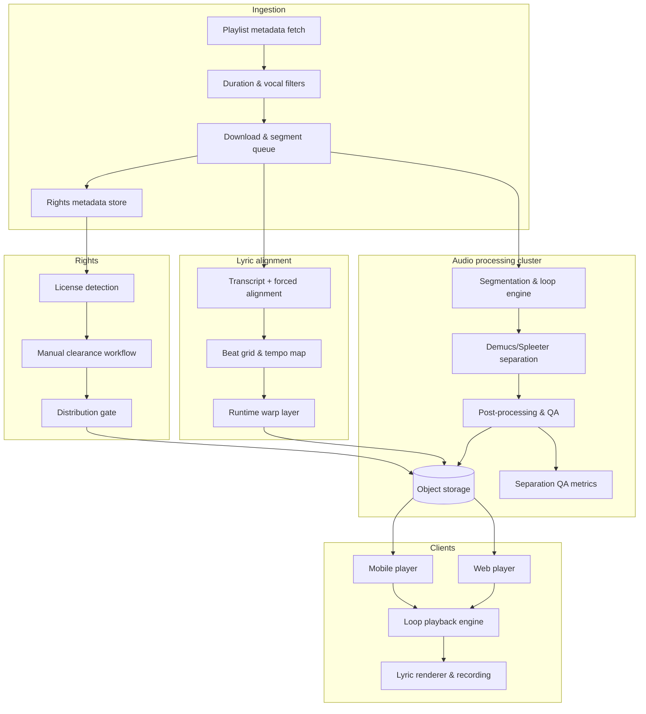

# Karaoke Pipeline Architecture

This document outlines the production-ready ingestion and playback pipeline for building a short-segment karaoke catalog from the playlist https://www.youtube.com/playlist?list=PL2vNBvHyEXihiuQ2htu6rLcOjw7lzsKcD.

## High-level diagram

## Services and responsibilities

- **Ingestion service (Python/Node)**: pulls playlist metadata with `yt-dlp`, filters by duration (≥40s), and enforces a vocal-presence threshold before download. Writes candidate metadata and rights state to SQLite/Postgres.
- **Rights management service**: stores license state per track, blocks distribution until cleared, logs provenance (YouTube ID, uploader, timestamp), and exposes clearance dashboards and pay-per-play hooks.
- **Audio processing cluster**: workers run segmentation, loop-point computation, normalization, separation (Demucs/Spleeter/Open-Unmix), post-processing (spectral gating, HPSS, inpainting), and quality checks (SDR/SIR, seam detection). Outputs include loop-ready stems, loop offsets, BPM/key, and QA flags.
- **Lyric alignment service**: combines transcript (YouTube captions or ASR) with forced-alignment (MFA/Gentle) and beat-tracking (librosa/madmom). A runtime warp layer adjusts timestamps for ±10% tempo and ±2 semitone pitch changes.
- **Storage/CDN**: object storage bucket for stems, loop buffers, alignment JSON/LRC, QA metrics, and rights metadata; CDN or signed URLs for cleared tracks.
- **Clients (web/mobile)**: low-latency audio engine with loop toggle, crossfade control, tempo/pitch shift, auto-realign on tempo changes, lyric rendering API, and recording pipeline for user vocals.

## Processing flow

1. **Metadata pass (M1)**: fetch playlist entries, drop videos under 40 seconds, and run a lightweight vocal presence classifier; rejected items and reasons are logged.
2. **Segmentation (M2)**: for each candidate, find the strongest 40–60s vocal-rich window (favor choruses), compute seamless loop points with crossfade buffers, normalize to target LUFS, and emit segment metadata (start, end, BPM, key, vocal score).
3. **Separation (M3)**: run Demucs v3 (or a faster variant) to create instrumental-reduced karaoke beds; apply spectral gating and HPSS to reduce bleed; compute SDR/SIR and flag low-quality stems.
4. **Lyric sync (M4)**: combine beat grids with forced-alignment; persist word/phoneme timestamps plus runtime warp parameters to survive tempo/pitch changes.
5. **Client demo (M5)**: ship a curated 100-track pack with cleared rights, precomputed loop assets, lyric alignment, and QA metrics; expose API endpoints for loop metadata and stems.
6. **Compliance (M6)**: every track stores license state and provenance; distribution is blocked until cleared; per-play events post to settlement hooks.

## QA metrics and gates

- **Duration filter**: 100% of ingested tracks must be ≥40s; enforcement happens before download.
- **Vocal filter**: reject instrumentals; target ≤5% false rejects on validation.
- **Loop quality**: segments must loop for 5 minutes without audible clicks; automatic seam detector plus spot checks.
- **Separation quality**: target SDR/SIR thresholds; stems below threshold are flagged for human review.
- **Lyric sync**: ≤100 ms error under ±10% tempo and ±2 semitone pitch shifts for 90% of tracks.
- **Rights**: license status recorded per track; unsigned or unclear items cannot be distributed.
