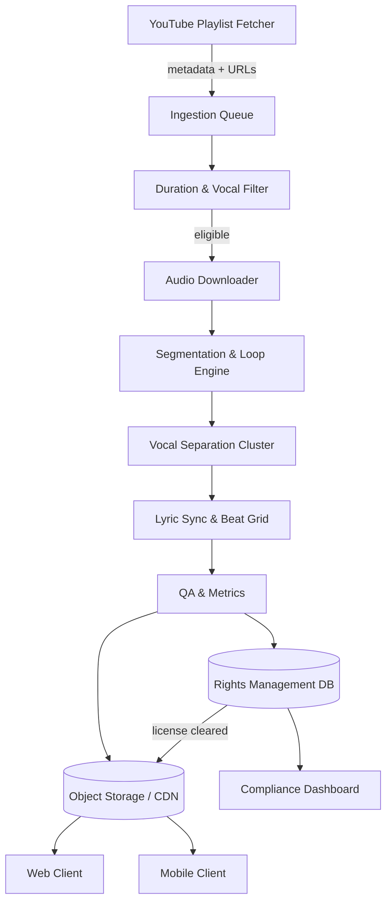

# Karaoke Ingestion and Playback Pipeline

This document captures a production-ready design for building a 40–60 second karaoke catalog from the YouTube playlist [`PL2vNBvHyEXihiuQ2htu6rLcOjw7lzsKcD`](https://www.youtube.com/playlist?list=PL2vNBvHyEXihiuQ2htu6rLcOjw7lzsKcD). It covers ingestion, segmentation, vocal separation, adaptive lyric sync, rights handling, QA gates, and demo packaging.

## Architecture



### Components
- **Ingestion service (Node or Python)**: fetch playlist metadata, enforce duration filter, queue downloads, and attach rights metadata with `license_state=pending` until cleared.
- **Audio processing workers (Python + ffmpeg)**: perform vocal-presence scoring, segmentation, loudness normalization, and loop-point calculation.
- **Separation cluster (Demucs/Spleeter/Open-Unmix)**: produce karaoke beds and isolated vocals with SDR/SIR quality metrics; flag low-quality separations for human review.
- **Lyric sync service**: forced alignment (MFA or Gentle) + beat-tracking (librosa/madmom) with runtime warp for tempo/pitch changes.
- **Rights service**: tracks license evidence, manual approvals, and blocks distribution while `license_state != cleared`.
- **Storage/CDN**: stores looped segments, stems, and metadata; distribution requires cleared rights.
- **Clients (web/mobile)**: low-latency audio engine with seamless looping, tempo/pitch controls, lyric rendering, and record/upload pipeline.

## Ingestion pipeline
1. **Fetch metadata** from the playlist with `yt-dlp` or YouTube Data API (if `YOUTUBE_API_KEY` set).
2. **Duration filter**: reject any entry with `duration < 40s`.
3. **Vocal presence filter**: run a classifier (lightweight CNN or heuristic spectral ratio) to discard instrumental-only tracks; allow a 5% false-reject budget.
4. **Rights metadata**: store `video_id`, `uploader`, `license`, and `license_state=pending_clearance`; block download/upload if rights not cleared.
5. **Queue downloads** to the processing workers with idempotent tasks and back-pressure (e.g., Redis, SQS, or BullMQ).

## Segmentation & loop engine
- **Goal**: pick the best 40–60s chorus-like window with strong vocals and compute seamless loop points.
- **Signals**: use harmonic energy, onset strength, and self-similarity matrices to locate recurring sections; bias towards the first high-vocal chorus.
- **Loop points**: snap loop start/end to beat grid, then add 30–80 ms crossfade buffers; validate seam by playing 5 minutes and inspecting RMS continuity.
- **Outputs**: `segment.wav`, loop metadata (`start`, `end`, `crossfade_ms`, `bpm`, `key`, `vocal_score`), and loudness normalized to -14 LUFS.

## Instrumental bleed reduction
- **Models**: Demucs v3 (default), with Spleeter/Open-Unmix as speed fallbacks; allow plugging in fine-tuned short-form checkpoints.
- **Postprocessing**: harmonic/percussive separation, spectral gating to attenuate residual vocals, and light inpainting on transients.
- **Metrics**: compute SDR/SIR with `museval`; flag stems below target for manual QA.

## Adaptive lyric sync
- **Alignment**: forced alignment (MFA/Gentle) to word/phoneme timestamps + beat tracking for tempo grid.
- **Runtime warp**: map lyric times through the current tempo/pitch transform; re-anchor on loop boundaries to keep drift ≤ 100 ms even under ±10% tempo and ±2 semitone pitch shifts.
- **Fallback**: manual timestamp editor in the UI for problematic tracks.

## QA tests and acceptance
- **Duration & vocal filters**: 100% of ingested tracks meet duration; ≤5% false rejects on vocals validation set.
- **Loop quality**: ≥95% of sample tracks play 5 minutes without audible seams.
- **Separation quality**: ≥80% meet SDR/SIR thresholds; the rest flagged.
- **Lyric sync**: ≤100 ms error for ≥90% of sample tracks under tempo/pitch perturbations.
- **Rights compliance**: no asset leaves `pending_clearance` until license evidence is stored.

## Rights & compliance checklist
- Capture `source_url`, `uploader`, `license`, `claimant`, `acquisition_method`, and `license_state` per track.
- Block any CDN upload or client exposure while `license_state != cleared`.
- Provide manual approval workflow and per-play reporting + settlement hooks.

## Demo pack and milestones
- **Demo pack**: curated 100 cleared tracks with looped stems, lyric files (LRC/JSON), and QA reports.
- **Milestones**:
  - M1: ingestion + filters on full playlist.
  - M2: segmented loops for 50 tracks.
  - M3: separation quality to target thresholds.
  - M4: lyric sync with runtime warp.
  - M5: client demo (web/mobile) with looping + synced lyrics.
  - M6: QA + rights clearance to staging.

## Example commands
```bash
# Metadata-only duration check
yt-dlp -j "VIDEO_URL" | jq '.duration'

# Extract candidate window
audio=downloaded.wav
start=60
duration=50
ffmpeg -ss "$start" -i "$audio" -t "$duration" -c:a pcm_s16le candidate.wav

# Loudness normalize
ffmpeg -i candidate.wav -af loudnorm=I=-14:TP=-1.5:LRA=11 normalized.wav

# Run Demucs separation
demucs --two-stems=vocals normalized.wav -o separations/

# Crossfade for loop seam
ffmpeg -i normalized.wav -af "afade=t=in:ss=0:d=0.05,afade=t=out:st=49.95:d=0.05" loop_ready.wav
```
